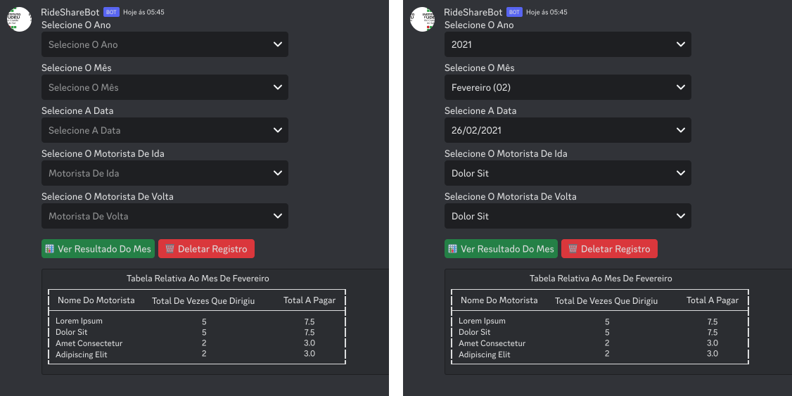

<h1>Projeto Ride Share Bot   Discord.py</h1>

    Criação De Um <b>Bot</b> Para O <b>Discord</b> Que Permite O <b>Registro De Caronas</b>, Usado Para A Faculdade. É Possível Definir A <b>Data</b> Da Carona, Qual <b>Motorista</b> Usou Para A <b>Ida</b> E Qual Usou Para A <b>Volta.</b> Através De Um <b>Botão</b>, É Possível Obter O <b>Resultado Do Valor Que Cada Motorista Deve Receber Pelo Mês Selecionado</b>. E Através De Outro <b>Botão, É Possível Deletar O Registro Pela Data Selecionada.</b>

 

    O Projeto Foi Criado Usando A Linguagem <b>Python E A Biblioteca Discord.py</b> E Para O <b>Banco De Dados</b>, Foi Usado O <b>SQLite3</b>.

 

Na Imagem Acima Temos O Bot No Canal Do Discord Onde Tem Componentes Selects Para O Ano, Mês, Data, Motorista De Ida E Motorista De Volta. E Abaixo Temos O Botão Para Obter O Resultado Que Em Formato De Tabela Mostra O Nome Do Motorista, A Quantidade De Vezes Que Digiriu E O Total A Pagar, E O Botão Para Deletar O Registro Pela Data Selecionada.

